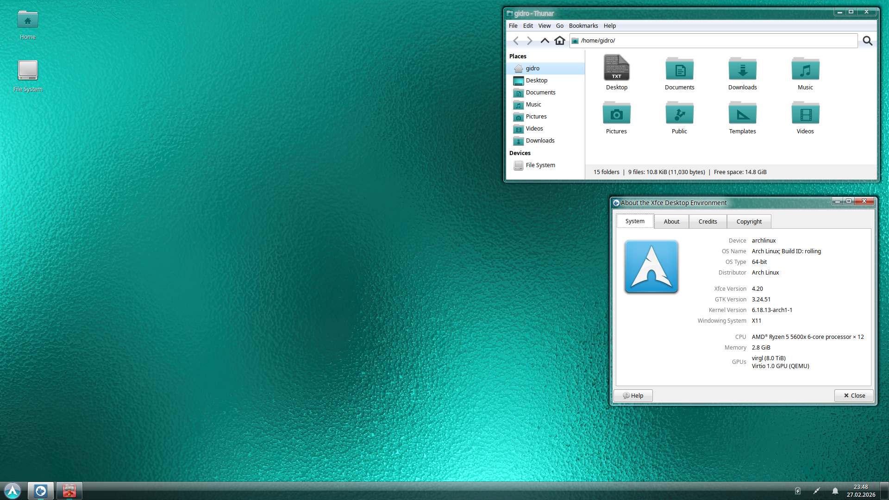

# xfce-aeroish

> [!IMPORTANT]  
> This custom image is still WIP and in an alpha phase.

Aero-like XFCE custom image based on Arch Linux base bootc image.

## Theming Credits and Base

For the Aeroish GTK2, GTK3, GTK4 and LightDM theme, I credit:
- ['ReVista' - x35gaming](https://github.com/x35gaming/revista), [slightly modified version by contrarybaton60](https://github.com/contrarybaton60/vista-stuff-xfce4/tree/main/gtk-theme)
For the Qt5 and Qt6 theme, I credit:
- ['AeroThemePlasma' - wackyideas](https://gitgud.io/aeroshell/atp/aerothemeplasma)
For the Emerald window decoration theme, I credit:
- ['Aero Glass' - winvistlinux, ILoveNat](https://www.gnome-look.org/p/1835389)
For the X11 cursors theme, I credit:
- ['Windows 7 Aero' - ILexian](https://github.com/lLexian/Windows-7-Aero-Cursors_Linux) + ['Aero Mouse Cursors with Drop Shadow' - Infinality](https://www.xfce-look.org/p/999972/)
For the XFCE-desktop GTK3 theme, I credit:
- ['aeroish-xfce4' - w4lll](https://github.com/w4lll/aeroish-xfce4/tree/main/config)
For the default icon set, I credit:
- ['Obsidian' - madmaxms](https://github.com/madmaxms/iconpack-obsidian)

## Highlights

Now that we know what's the theming base and other defaults, I'll highlight what I added on top of it.

- Image setup in shortly is explained like this:
  - arch-base + dracut + bootc (with composefs) + SystemD + Xorg + LightDM + NetworkManager + chronyd + bluez + systemd-resolved + Pipewire + mesa (OpenGL) + vulkan + XFCE4 base + XFCE4 goodies like screenshotter and its applet plugins + theming
- Has automatic seamless system updates enabled (runs atomic `bootc upgrade` once per day).
- Uses `compiz` as the compositing window manager and `emerald` as the window decorator.
- Additional `compiz` defaults that enables blur, snap and grid plugins + blurs taskbar and start menu. Also modified grid plugin to use colors matching the default background.
- Modified XFCE-desktop GTK3 theme to make applets size square-consistent, to make all applets use the Aero button hover and press theme and to make Start menu coloring closer to taskbar.
- Preconfigured variables, config and scripts for default theming, which includes: LightDM login screen, GTK2, GTK3, GTK4 (including Adwaita), Qt5, Qt6 and XFCE-desktop.
- Installed and preconfigured Whisker-menu, docklike-taskbar, xfce4-power-manager, network-manager-applet, xfce4-pulseaudio-plugin, system tray, notifier, clock.
- Installs `qt5ct` and `qt6ct` in addition to Kvantum, so the Qt apps behavior can be modified further.
- Uses the cool teal glass background as the default.
- Uses Noto Sans as the font, 9 as the size.
- etc...

## How to install

1. Download Fedora Vauxite ISO from [this URL](https://github.com/winblues/vauxite) and install it regularly
2. When you boot to Vauxite, run this command below to switch to `xfce-aeroish` (requires internet connection):
  - `sudo bootc switch ghcr.io/fiftydinar/xfce-aeroish:latest`
3. Reboot the system
4. Boot the Arch entry
5. 1st boot will fail with blinking line in top-left, but 2nd one will be successful (rebase workaround which only applies on 2nd boot)
6. Install the container signatures required for signed image of `xfce-aeroish` (requires internet connection):
  - `sudo bootc switch --enforce-container-sigpolicy ghcr.io/fiftydinar/xfce-aeroish:latest`
7. Reboot the system
8. Remove `$HOME/.config/xfce4/xfconf/xfce-perchannel-xml/` folder, then log out and log in. This is to reset user XFCE settings if changed previously by Vauxite
9. Enjoy!

## Caveats

This image is based on the experimental work of [arch-bootc](https://github.com/bootcrew/arch-bootc) base image, so some issues might arise.  

1. GRUB bootloader cannot be updated
  - It will stay on the same version basically forever, because [bootupd](https://github.com/coreos/bootupd) only works on Fedora and CoreOS based distributions.
2. Installing or using other bootloader is unsupported
  - For the same reason as 1.
3. Using different initramfs other than `dracut` is unsupported
  - Using `mkinitcpio` and others might work with some modifications, but upstream primarily uses `dracut`, which is also used here
4. Secure boot doesn't work and is unsupported
  - For the same reason as 1 + unsigned kernel by default
